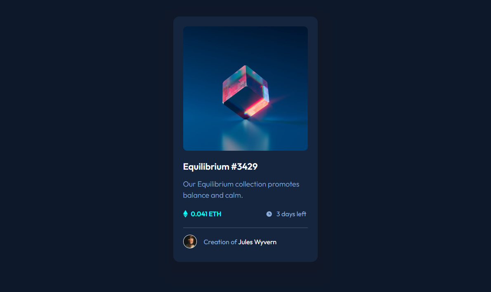
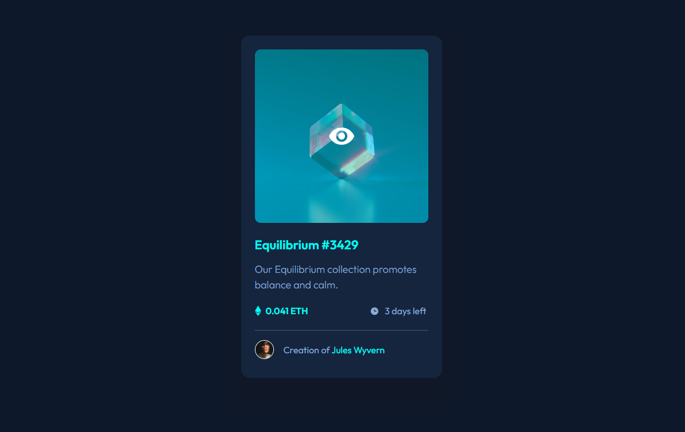

# Frontend Mentor - QR code component solution

This is a solution to the [NFT preview card component](https://www.frontendmentor.io/challenges/nft-preview-card-component-SbdUL_w0U).

## Table of contents

- [Overview](#overview)
  - [Screenshot](#screenshot)
  - [Links](#links)
- [My process](#my-process)
  - [Built with](#built-with)
  - [Author](#author)

## Overview

### Screenshot

### Active state

### Links

- Solution URL: [https://github.com/olepak/nft.git)
- Live Site URL: [https://olepak.github.io/nft/)

## My process

### Built with

- HTML5 markup
- CSS custom properties

## Author

- Frontend Mentor - [@olepak](https://www.frontendmentor.io/profile/olepak)
- Twitter - [@LepakOleksandr](https://twitter.com/LepakOleksandr)
